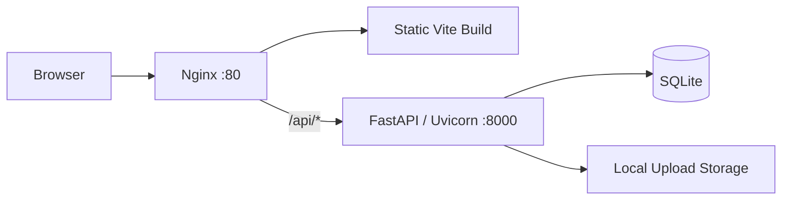

# Architecture

## High-Level Flow

## Backend Modules

- `app/main.py`: FastAPI application factory, CORS setup, router registration, upload mount, health check.
- `app/api/v1/`: versioned REST API routers.
- `app/models/`: SQLAlchemy ORM models for users, colleges, teams, resources, reviews, notices, likes, reports, and comments.
- `app/schemas/`: Pydantic request and response schemas.
- `app/services/`: domain services, currently centered on authentication and verification code flow.
- `app/storage/`: filesystem storage abstraction.
- `app/utils/`: authentication dependencies and JWT/password utilities.

## API Surface

The active API prefix is `/api/v1`.

- `auth`: registration, verification code, login, current user profile.
- `colleges`: college CRUD.
- `partitions`: hierarchical resource partition management.
- `teams`: team CRUD, decorations, role definitions, members, notices, join requests.
- `users`: user administration and approval.
- `resources`: media resource CRUD, uploads, submission, likes, reports, comments, images.
- `reviews`: pending reviews, review decisions, report resolution.
- `stats`: platform and user statistics.

## Deployment Topology

Nginx serves `static/` directly and proxies API traffic to Uvicorn. Uvicorn runs the ASGI app from `backend/app/main.py` as `app.main:app`. Uploaded files are stored outside the Git repository and exposed through Nginx `/uploads/`.
